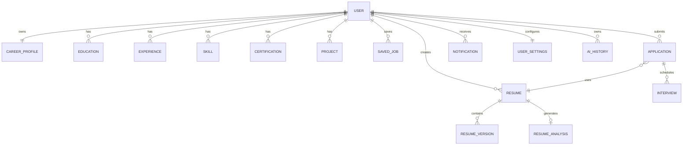

# Entity Relationship Diagram (ERD)

**Product:** CareerOS

**Version:** 1.0

**Status:** Approved

---

# Purpose

This document defines the high-level Entity Relationship Diagram (ERD) for CareerOS. It describes the core business entities, their relationships, ownership, and cardinality.

The ERD serves as the foundation for the physical database schema and ensures consistency across all business modules.

---

# Scope

This document covers:

- Core business entities
- Entity ownership
- Entity relationships
- Relationship cardinality
- Business rules
- Module boundaries

Field-level definitions and SQL implementation are documented separately in the Database Schema.

---

# Design Principles

The CareerOS database follows these principles:

- Every entity has a clear owner.
- Business domains remain modular.
- Relationships are explicit.
- Minimize data duplication.
- Maintain referential integrity.
- Use foreign keys for relationships.
- Avoid circular dependencies.

---

# Core Entity Relationship Diagram



---

# Primary Entities

## User

The central entity of the system.

Owns:

- Career Profile
- Skills
- Education
- Experience
- Projects
- Certifications
- Resumes
- Applications
- Interviews
- Notifications
- Settings
- AI History

---

## Career Profile

Stores the user's professional profile.

Contains:

- Personal information
- Professional summary
- Career preferences
- Contact details

Relationship:

```text
User (1) ------ (1) Career Profile
```

---

## Resume

Represents a resume created by the user.

A user may create multiple resumes.

Relationship:

```text
User (1) ------ (N) Resume
```

---

## Resume Version

Supports resume versioning.

Relationship:

```text
Resume (1) ------ (N) Resume Version
```

Each version represents a snapshot of a resume.

---

## Resume Analysis

Stores AI-generated resume analysis.

Relationship:

```text
Resume (1) ------ (0..1) Resume Analysis
```

Analysis can be regenerated.

---

## Education

Stores educational qualifications.

Relationship:

```text
User (1) ------ (N) Education
```

---

## Experience

Stores work experience.

Relationship:

```text
User (1) ------ (N) Experience
```

---

## Skills

Stores professional skills.

Relationship:

```text
User (1) ------ (N) Skill
```

---

## Projects

Stores portfolio projects.

Relationship:

```text
User (1) ------ (N) Project
```

---

## Certifications

Stores certifications.

Relationship:

```text
User (1) ------ (N) Certification
```

---

## Saved Jobs

Stores bookmarked jobs.

Relationship:

```text
User (1) ------ (N) Saved Job
```

---

## Applications

Tracks job applications.

Relationship:

```text
User (1) ------ (N) Application
```

Each application references one resume.

```text
Application (N) ------ (1) Resume
```

---

## Interviews

Tracks interview schedules and progress.

Relationship:

```text
Application (1) ------ (N) Interview
```

---

## Notifications

Stores system notifications.

Relationship:

```text
User (1) ------ (N) Notification
```

---

## User Settings

Stores user preferences.

Relationship:

```text
User (1) ------ (1) User Settings
```

---

## AI History

Stores AI-generated outputs.

Examples:

- Resume Analysis
- Cover Letters
- Career Advice
- Interview Feedback

Relationship:

```text
User (1) ------ (N) AI History
```

---

# Relationship Summary

| Parent | Child | Cardinality |
|----------|--------|-------------|
| User | Career Profile | 1 : 1 |
| User | Education | 1 : N |
| User | Experience | 1 : N |
| User | Skill | 1 : N |
| User | Project | 1 : N |
| User | Certification | 1 : N |
| User | Resume | 1 : N |
| Resume | Resume Version | 1 : N |
| Resume | Resume Analysis | 1 : 0..1 |
| User | Saved Job | 1 : N |
| User | Application | 1 : N |
| Resume | Application | 1 : N |
| Application | Interview | 1 : N |
| User | Notification | 1 : N |
| User | User Settings | 1 : 1 |
| User | AI History | 1 : N |

---

# Module Ownership

| Module | Primary Entities |
|----------|-----------------|
| Authentication | User |
| Career Profile | Career Profile, Education, Experience, Skill, Project, Certification |
| Resume | Resume, Resume Version, Resume Analysis |
| Jobs | Saved Job |
| Applications | Application |
| Interviews | Interview |
| Notifications | Notification |
| AI Coach | AI History |
| Settings | User Settings |

Each module owns its entities and is responsible for managing their lifecycle.

---

# Design Notes

- Every business entity belongs to a single module.
- Every user-owned entity references the User table.
- Child entities cannot exist without their parent.
- Cross-module relationships use foreign keys while respecting module boundaries.
- Business logic remains in the Service Layer, not in database relationships.

---

# References

Depends On:

- 01-database-design-overview.md

Used By:

- 03-database-schema.md
- API Design
- Backend Architecture

---

# Summary

The CareerOS Entity Relationship Diagram defines the core entities and their relationships across all business modules. It establishes clear ownership, normalized relationships, and referential integrity, providing the structural foundation for the physical database schema and future application development.