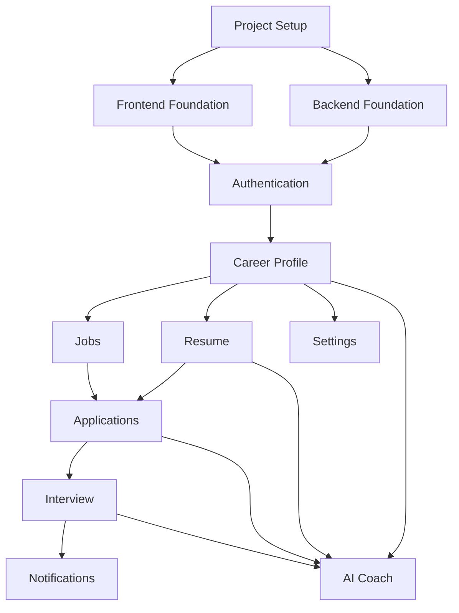

# Module Dependency Map

## Purpose

This document defines the dependency relationships between all major CareerOS modules.

It ensures developers and AI coding agents implement modules in the correct order, avoiding circular dependencies and unnecessary rework.

This document is the authoritative reference for module implementation order.

---

# Dependency Principles

CareerOS follows a modular architecture.

Each module should:

- Have a single responsibility.
- Depend only on required modules.
- Avoid circular dependencies.
- Expose functionality through well-defined APIs or services.
- Remain independently testable.

---

# High-Level Dependency Flow

```text
Project Setup
        │
        ▼
Backend Foundation
        │
        ▼
Frontend Foundation
        │
        ▼
Authentication
        │
        ▼
Career Profile
        │
 ┌──────┼────────┐
 ▼      ▼        ▼
Resume  Jobs   Settings
   │      │
   │      ▼
   └──► Applications
            │
            ▼
        Interview
            │
            ▼
      Notifications
            │
            ▼
         AI Coach
```

---

# Mermaid Dependency Diagram



---

# Module Dependency Matrix

| Module | Depends On |
|----------|------------|
| Project Setup | None |
| Backend Foundation | Project Setup |
| Frontend Foundation | Project Setup |
| Authentication | Backend Foundation, Frontend Foundation |
| Career Profile | Authentication |
| Resume | Career Profile |
| Jobs | Career Profile |
| Applications | Resume, Jobs |
| Interview | Applications |
| Notifications | Interview |
| AI Coach | Career Profile, Resume, Applications, Interview |
| User Settings | Career Profile |

---

# Detailed Dependencies

## Authentication

### Requires

- Backend Foundation
- Frontend Foundation

### Provides

- User identity
- JWT authentication
- Authorization
- Session management

---

## Career Profile

### Requires

- Authentication

### Provides

- Personal Information
- Education
- Experience
- Skills
- Projects
- Certifications

---

## Resume

### Requires

- Career Profile

### Uses

- Skills
- Experience
- Education
- Projects
- Certifications

---

## Jobs

### Requires

- Career Profile

### Uses

- User preferences
- Skills
- Career interests

---

## Applications

### Requires

- Resume
- Jobs

### Uses

- Resume versions
- Job information

---

## Interview

### Requires

- Applications

### Uses

- Application history
- Job details
- Company information

---

## Notifications

### Requires

- Interview

### Uses

- Events generated by all modules

Examples:

- Application updates
- Interview reminders
- Resume analysis completion
- AI recommendations

---

## AI Coach

### Requires

- Career Profile
- Resume
- Applications
- Interview

### Uses

- Complete career data
- Resume analytics
- Interview history
- Skill analysis

---

## User Settings

### Requires

- Authentication
- Career Profile

### Uses

- User preferences
- Notification settings
- Account settings
- Privacy settings

---

# Cross-Module Communication Rules

Modules must never access another module's internal implementation directly.

Communication should occur through:

- Public services
- APIs
- Shared interfaces
- Events (where applicable)

Direct database access between unrelated modules should be avoided.

---

# Circular Dependency Policy

Circular dependencies are prohibited.

Example:

❌ Resume → Applications → Resume

Instead:

Resume → Applications

or

Shared functionality should be extracted into a common service.

---

# Future Modules

Future modules should declare:

- Required dependencies
- Modules they expose services to
- Public APIs
- Database ownership

before implementation begins.

---

# Maintenance

Whenever a new module is introduced:

1. Update the dependency diagram.
2. Update the dependency matrix.
3. Review for circular dependencies.
4. Validate implementation order.
5. Update the development roadmap if required.

---

# Summary

The dependency order for the CareerOS MVP is:

1. Project Setup
2. Backend Foundation
3. Frontend Foundation
4. Authentication
5. Career Profile
6. Resume
7. Jobs
8. Applications
9. Interview
10. Notifications
11. AI Coach
12. User Settings

No module should be implemented before all of its required dependencies are complete.